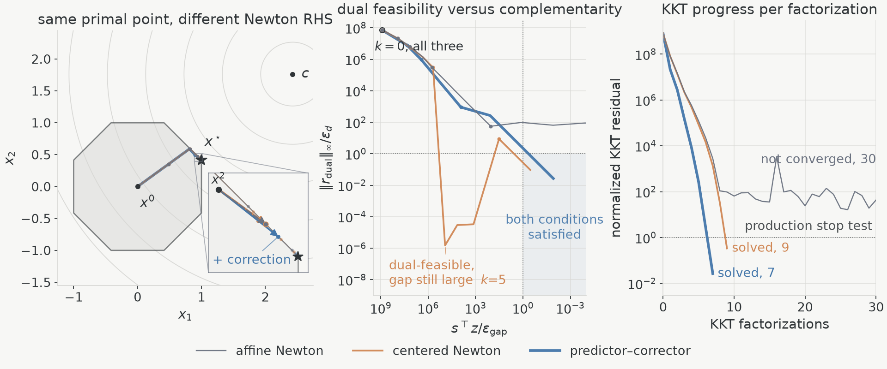

# barrierQP



<p align="center"><sub><em>Three runs on the same quadratic program, from the same start, under the same stop
test. The affine predictor reaches the optimum to 5.6 × 10<sup>−17</sup> and drives the
complementarity gap to 1.4 × 10<sup>−42</sup> times its tolerance — and never converges,
through all 30 factorizations. The other two need 9 and 7. All three linearize the
same KKT matrix; difference is the right-hand side.</em></sub></p>

barrierQP is a ~260-line JAX solver built around that, and around one other idea: the
corrector is a second right-hand side, not a second factorization. Each barrier
iteration LU-factors one reduced KKT matrix and asks it two questions — where the
affine step would go, and how badly that step's own linear model missed. An
$N$-iteration solve does exactly $N$ factorizations and $2N$ Newton solves. The
factorization is the expensive half; the second question is nearly free.

## quick start

[`Predictor-Corrector.ipynb`](Predictor-Corrector.ipynb) is committed with its output:
per-iteration ledgers, assertions, the figure above. It solves a 2-D pentagon with the
public `Solver` and reports the counters, then runs the octagon experiment above.

To run it yourself you need Python 3.12 and [uv](https://docs.astral.sh/uv/):

```bash
uv run --group demo jupyter lab Predictor-Corrector.ipynb
```

CPU float64 is canonical; `uv sync --extra cuda` adds the optional CUDA backend.

## the solver

```math
\min_x \ \tfrac{1}{2}x^\top P x + q^\top x \quad\text{s.t.}\quad A x = b,\ \ G x \leq h,
```

with $P \succ 0$ and dense. Equality and inequality blocks may have zero rows; with no
inequalities there is no barrier to iterate, and the answer is a single direct KKT
solve.

```python
import barrierqp

solver = barrierqp.Solver(P, q, A, b, G, h)   # arrays; A / G may have zero rows
result = solver.solve()

result.status        # "solved" | "max_iter" | "numerical_error" | "invalid_problem"
result.x, result.y, result.z, result.s
result.iterations, result.factorizations, result.newton_solves
```

`step` is one Mehrotra iteration: `form_kkt` builds the reduced matrix — the barrier
enters only as the diagonal weight in $P + G^\top \mathrm{diag}(z/s) G$, bordered by
the equality rows $A$ — `lu_factor` factors it once, and `solve_direction` is called
twice against that one factor, with the centering $\sigma = (\mu_\mathrm{aff}/\mu)^3$
measured by the affine step in between. The whole iteration runs inside one compiled
`jax.lax.while_loop`. All of it is in
[`src/barrierqp/solver.py`](src/barrierqp/solver.py).

## predictor–corrector

Complementarity is the only nonlinear equation in the KKT system, and a Newton step
linearizes it — dropping the second-order term $\Delta s \odot \Delta z$. The affine
predictor takes that step and, in doing so, measures exactly how much the linear model
missed by. Mehrotra's corrector adds that measured miss back, together with adaptive
centering, as a second right-hand side for the factorization the predictor has already
paid for. Same Jacobian, new question.

The QP above is a regular octagon with unit-norm rows and a sharp-vertex optimum,
solved three times from one centered start under one production stop test, every
residual divided by the tolerance the solver computes at that same iterate. The affine
predictor alone reaches $x^\star$ to $5.6\times10^{-17}$ and drives the complementarity
gap to $1.4\times10^{-42}$ times its tolerance — the best of the three on both counts —
and still never converges: collapsing $s \odot z$ term by term destroys centrality,
which stalls at 2.621 of a possible 2.646, and the dual residual sits at 44 times its
own tolerance through all 30 factorizations. Adaptive centering fixes that in 9;
adding the measured correction needs 7, at one factorization and two right-hand sides
each. The notebook checks that its predictor–corrector branch reproduces the
production `step` exactly — measured difference `0.0e+00` in $x, y, z, s$ over ten
iterations — so the comparison is against the shipped iteration, not a variant of it.

A small complementarity gap is not convergence, which is why convergence is reported
through the stop test and never through $\lVert x - x^\star\rVert$ alone. The predictor
finds the miss; the corrector repairs it without refactorizing the geometry.

## limitation

- not an interior-point method you should ship: no Phase I, no infeasibility or
  unboundedness certificate, no homogeneous embedding, no warm start, no scaling,
  regularization, or iterative refinement;
- dense, strictly convex QPs only — $P \succ 0$ is a precondition the constructor
  checks with a Cholesky, not something the iteration discovers;
- no sparse or OCP structure, cone API, autodiff, custom GPU kernel, or multi-device
  execution;
- non-finite iterates come back as `numerical_error` and invalid or non-convex data as
  `invalid_problem`; neither is ever reported as a solve.

`bench.py` times this against PIQP, Clarabel and OSQP locally
(`uv run --group bench python bench.py`) — an experiment, not a solver ranking.

## references

- [Mehrotra, *On the Implementation of a Primal-Dual Interior Point
  Method*](https://epubs.siam.org/doi/10.1137/0802028) for the affine predictor, the
  centering heuristic, and the second-order corrector.
- [Boyd and Vandenberghe, *Convex
  Optimization*](https://web.stanford.edu/~boyd/cvxbook/bv_cvxbook.pdf), chapter 11,
  for the central path, the perturbed KKT system, and the centrality reading of the
  ablation above.
- [Frison and Diehl, *HPIPM*](https://arxiv.org/abs/2003.02547) for the delta
  formulation, slack/dual elimination, residual ledger, and factor reuse.
- [Google DeepMind's QTQP](https://github.com/google-deepmind/qtqp) for chronological
  iteration structure and complementarity diagnostics.
- [OSQP](https://arxiv.org/abs/1711.08013) for the final-point comparison.
- [JAX](https://docs.jax.dev/) and [QPAX](https://github.com/qpax-solver/qpax) for the
  factor/solve and compiled-loop patterns.
- [qpbenchmark](https://github.com/qpsolvers/qpbenchmark) if you want a real solver
  benchmark.
