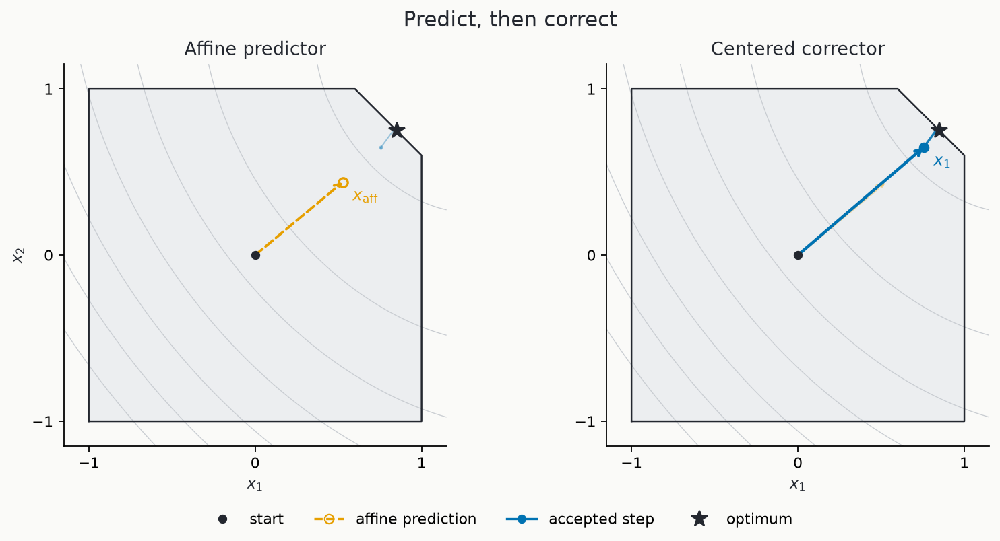
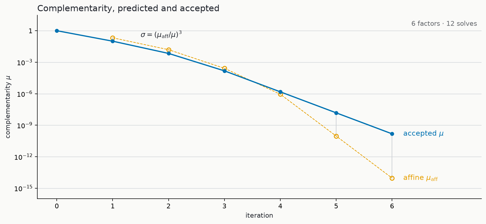

# barrierQP

A tiny JAX solver for dense, strictly convex quadratic programs with equality
and inequality constraints. It implements Mehrotra's primal-dual
predictor-corrector method: each iteration reduces the four-block Newton
system, factors one KKT matrix, and reuses that single factorization for both
the affine predictor and the centered corrector directions.

The repository contains one solver module and one executable notebook. The
notebook uses a fixed pentagon with a known boundary optimum, solved in 6
iterations with 6 factorizations and 12 Newton solves, and checks the reported
results against independent calculations.



Orange is the affine Newton proposal and blue is the accepted corrector path,
both computed from the same factorization.

## Quick start

Python 3.12 and [uv](https://docs.astral.sh/uv/) are required. From the
repository root:

```bash
JAX_PLATFORMS=cpu uv run --group notebook jupyter execute central_path.ipynb
```

The notebook runs its validation checks and regenerates the two figures in
`assets/`. Opening it shows the iteration ledger, an independent full
four-block Newton reference, an exact
rational audit of the first iteration, trajectory and JIT parity checks, and
an OSQP comparison.

Basic usage:

```python
solver = barrierqp.Solver(P, q, A, b, G, h)
result = solver.solve()          # compiled fixed-shape while-loop
result, trace = solver.trace()   # same jitted step, every iteration recorded
```

On a compatible NVIDIA system, `uv sync --extra cuda` installs the CUDA
backend and the same notebook passes on the default device with identical
iteration counts (the figures are then regenerated by that device's run).

## Problem

barrierQP accepts the standard-form quadratic program

```math
\begin{aligned}
\min_x \quad & \frac{1}{2}x^\top P x + q^\top x \\
\text{subject to} \quad & A x = b, \\
                         & G x \leq h.
\end{aligned}
```

where $P \succ 0$. Inequalities use positive slacks $s=h-Gx$, equality duals
$y$, and positive inequality duals $z$. The implementation permits zero
equality rows but requires at least one inequality.

## Method and example results

Each iteration reuses one LU factorization for the affine predictor and the
centered corrector. The affine direction estimates how much complementarity
a pure Newton step could remove; the cubed ratio
$\sigma = (\mu_{\mathrm{aff}} / \mu)^3$ then sets the centering
in the corrector, which also carries the second-order term
$\Delta s_{\mathrm{aff}} \circ \Delta z_{\mathrm{aff}}$.



The affine point predicts the attainable gap; the accepted point above it
includes centering and the second-order correction. For the pentagon example,
the notebook reports:

```text
6 iterations, 6 factorizations, 12 Newton solves
max full/reduced direction difference: 2.09e-15 (pentagon), 1.93e-12 (all fixtures)
final KKT residual: 8.47e-10
```

## Project structure

1. [`barrierqp.py`](barrierqp.py) (297 lines) contains the `Solver` facade,
   residuals, reduced KKT matrix, one LU
   factorization, affine solve, $\mu_{\mathrm{aff}}$ and $\sigma$, corrector
   solve, fraction-to-boundary steps, stop test.
2. [`central_path.ipynb`](central_path.ipynb) (16 cells) runs the pentagon
   example and regenerates both figures. Its checks include an independent
   eager four-block reference, an exact `fractions.Fraction` audit of the
   first iteration, and a final comparison with OSQP.

## Design

The design follows Sections 3.1–3.3, “Primal-dual IPM” through “KKT system
solution” (PDF pp. 3–4), of [*HPIPM: a high-performance quadratic programming
framework for model predictive control*](https://arxiv.org/pdf/2003.02547).

## Validation

The notebook contains the validation checks:

- the first iteration on an integer fixture against exact
  `fractions.Fraction` arithmetic, derived in the notebook itself;
- every affine and corrector direction, centering scalar, and full state
  trajectory against fresh full four-block solves on four fixtures, including
  one with no equality rows;
- strict positivity of every recorded slack and inequality dual, and reduced
  linear residuals below 1e-10;
- eager versus jitted steps, the compiled `lax.while_loop` against the traced
  loop, fixed loop-carry shapes and dtypes, and the N factorization / 2N
  solve bookkeeping;
- final objectives, solutions, and KKT residuals against OSQP.

Run it on CPU and on the default JAX device:

```bash
JAX_PLATFORMS=cpu uv run --group notebook jupyter execute central_path.ipynb
uv run --extra cuda --group notebook jupyter execute central_path.ipynb
```

The final floating-point digits may vary across devices or separate XLA
compilations; iteration counts do not.

## Limitations

- dense, well-scaled QPs with $P\succ0$, independent equality rows, and a
  strict interior only;
- no Phase I method, infeasibility or unboundedness certificate, homogeneous
  embedding, scaling, regularization, or iterative refinement;
- no sparse or OCP structure, cone API, warm start, or alternative
  initialization;
- no autodiff layer, custom GPU kernel, multi-device execution, or sparse
  performance path;
- factorization failures propagate from JAX; the only solver outcomes are
  `solved` and `max_iter`.

## References

- [Mehrotra, *On the Implementation of a Primal-Dual Interior Point
  Method*](https://epubs.siam.org/doi/10.1137/0802028) for the affine predictor,
  centering heuristic, and second-order corrector.
- [Frison and Diehl, *HPIPM*](https://arxiv.org/abs/2003.02547) for the delta
  formulation, slack/dual elimination, residual ledger, and factor reuse.
- [Google DeepMind's QTQP](https://github.com/google-deepmind/qtqp)
  for chronological iteration structure and complementarity diagnostics.
- [OSQP](https://arxiv.org/abs/1711.08013) for the final-point comparison.
- [JAX documentation](https://docs.jax.dev/) and
  [QPAX](https://github.com/qpax-solver/qpax) for factor/solve and compiled-loop
  patterns in JAX.
